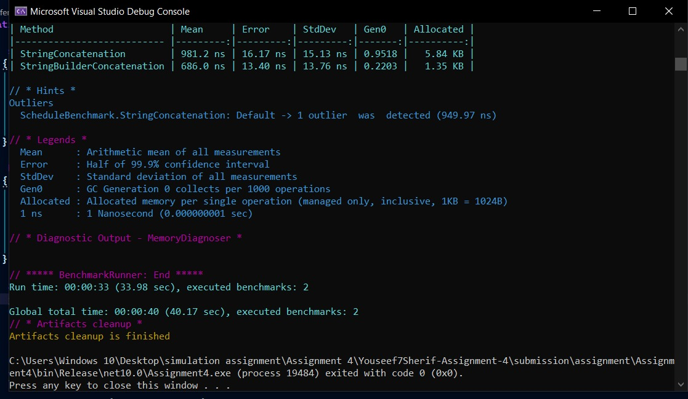

# Benchmark Results

## Benchmark Purpose

This benchmark compares two approaches for building the academy schedule report:

* String concatenation using `string`
* String concatenation using `StringBuilder`

The benchmark measures execution time and memory allocation using BenchmarkDotNet.

## Benchmark Environment

* BenchmarkDotNet: 0.15.8
* .NET: 10.0.12
* OS: Windows 10
* CPU: 11th Gen Intel Core i7-1165G7 2.80GHz
* Configuration: Release

## Results

| Method                     |     Mean | Allocated |
| -------------------------- | -------: | --------: |
| StringConcatenation        | 981.2 ns |   5.84 KB |
| StringBuilderConcatenation | 686.0 ns |   1.35 KB |

## Benchmark Output

The following screenshot shows the BenchmarkDotNet execution results:

## Analysis

The benchmark shows that `StringBuilderConcatenation` performed better than `StringConcatenation`.

`StringBuilderConcatenation` had an average execution time of **686.0 ns**, while `StringConcatenation` had an average execution time of **981.2 ns**.

It also allocated significantly less memory:

* String concatenation: **5.84 KB**
* StringBuilder: **1.35 KB**

Therefore, in this benchmark, `StringBuilder` was faster and used less memory than repeated string concatenation.

## Conclusion

For repeatedly building strings inside loops, `StringBuilder` can be more efficient because it reduces the number of intermediate string objects created during concatenation.
