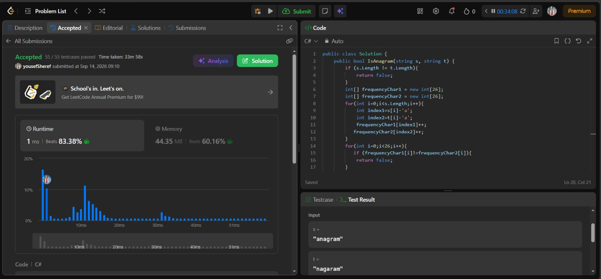
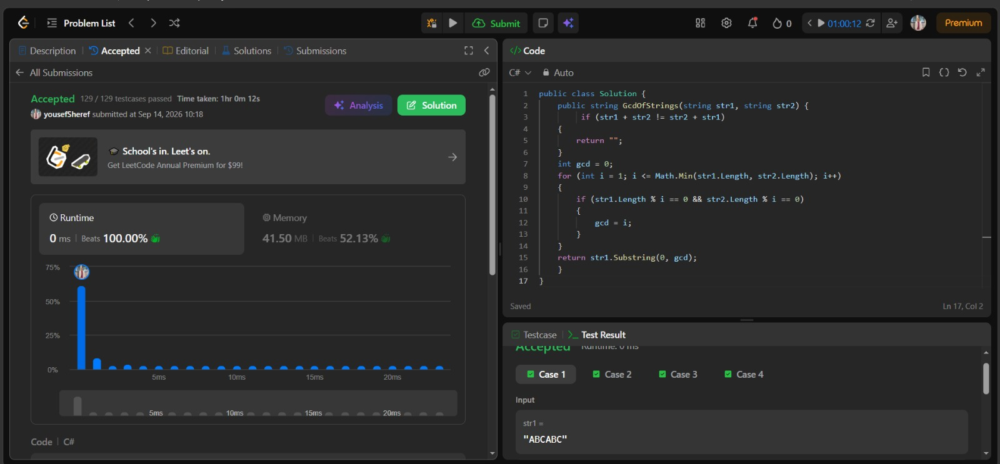

# LeetCode Submissions

## LeetCode Account

LeetCode Profile:
https://leetcode.com/u/yousefSheref/

---

## Valid Anagram

**Problem Name:** Valid Anagram

**Problem URL:**
https://leetcode.com/problems/valid-anagram/

### Approach

The solution first checks whether the two strings have the same length. If their lengths are different, they cannot be anagrams, so the solution returns `false`.

For strings with the same length, the solution uses two integer arrays of size 26 to store the frequency of each lowercase English character.

Each character is mapped to an index from 0 to 25:

- `a` → 0
- `b` → 1
- ...
- `z` → 25

The solution counts the frequency of every character in both strings and then compares the two frequency arrays. If all frequencies are equal, the strings are anagrams. Otherwise, they are not.

### Complexity

- **Time Complexity:** O(n)
- **Space Complexity:** O(1)

The space complexity is O(1) because the solution uses two fixed-size arrays containing 26 elements.

### Accepted Submission



---

## Greatest Common Divisor of Strings

**Problem Name:** Greatest Common Divisor of Strings

**Problem URL:**
https://leetcode.com/problems/greatest-common-divisor-of-strings/

### Approach

A string divides another string when the first string can be repeated a whole number of times to produce the second string.

The solution first checks whether:

```text
str1 + str2 == str2 + str1
```

If they are not equal, the two strings cannot be built from the same repeating pattern, so there is no common divisor string and the solution returns an empty string.

If they are equal, the solution finds the greatest common divisor of the two string lengths. This gives the maximum possible length of the common repeating pattern.

The solution then takes the first `gcd` characters of `str1` as the answer.

### Complexity

- **Time Complexity:** O(n)
- **Space Complexity:** O(n)

The time complexity is linear with respect to the input string lengths. The additional space comes mainly from creating the concatenated strings used to compare the repeating patterns.

### Accepted Submission


